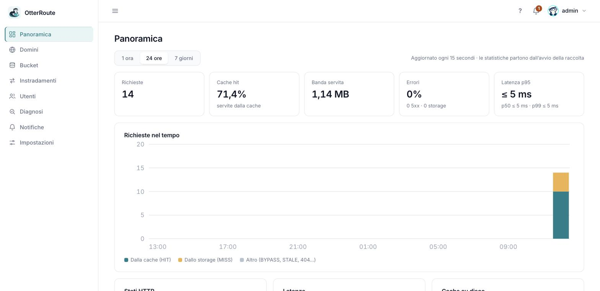
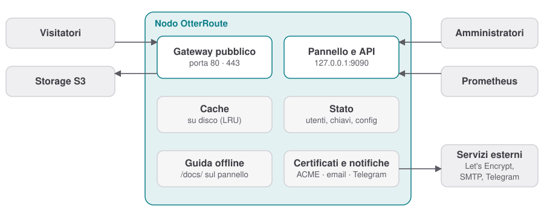
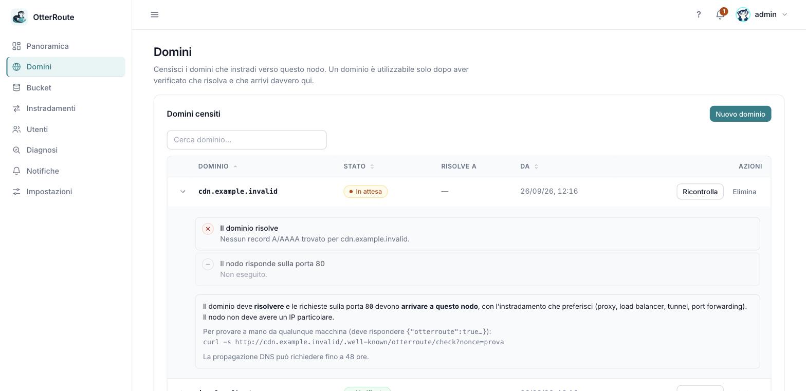
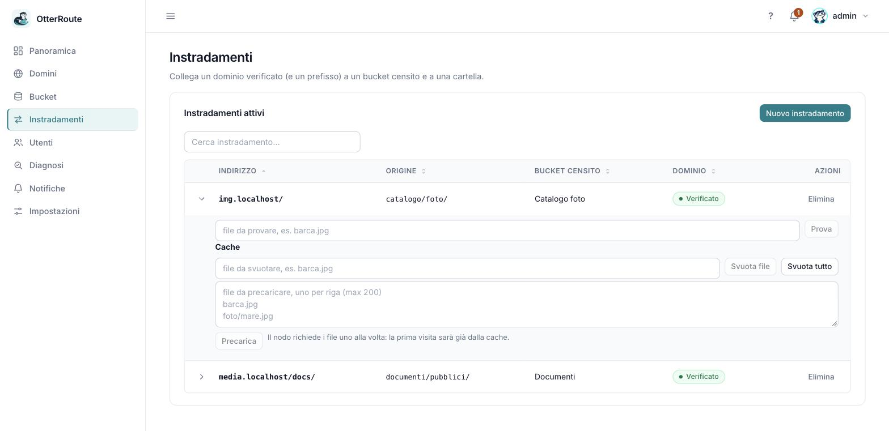

<p align="center">
  
</p>

<h1 align="center">OtterRoute</h1>

<p align="center">
  <strong>Pubblica i tuoi bucket S3 privati su più domini, con cache su disco. Senza toccare un proxy.</strong><br>
  <sub>Self-hosted · sola lettura · un solo binario · pannello in italiano e inglese</sub>
</p>

<p align="center">
  <a href="https://github.com/garzuu/OtterRoute/actions/workflows/ci.yml"></a>
  <a href="https://github.com/garzuu/OtterRoute/releases/latest"></a>
  <a href="https://github.com/garzuu/OtterRoute/pkgs/container/otterroute"></a>
  
</p>

<p align="center">
  <b>Italiano</b> · <a href="README.md">English</a><br>
  <a href="https://garzuu.github.io/OtterRoute/"><b>📖 Guida</b></a> ·
  <a href="#avvio-rapido">Avvio rapido</a> ·
  <a href="CHANGELOG.md">Novità</a>
</p>

<p align="center">
  
</p>

---

## Perché

Hai file in uno o più bucket S3 (AWS, Cloudflare R2, Backblaze B2, Wasabi, Hetzner, MinIO, Garage…) e vuoi servirli da **`cdn.tuosito.it`** senza rendere pubblico il bucket, senza scrivere regole di proxy e senza pagare ogni richiesta allo storage.

Colleghi lo storage, associ un dominio, e ottieni un URL che funziona. Il nodo **verifica davvero** che il dominio arrivi a lui, tiene i file in cache su disco e ti dice, in italiano, dove si ferma una richiesta quando qualcosa non va.

<p align="center">
  
</p>

## Cosa fa

| | |
|---|---|
| 🌐 **Più domini, più bucket** | Instradamento per host e prefisso di percorso; ogni bucket ha le sue credenziali, la cache è isolata. |
| 🔒 **Sola lettura** | Solo `GET` e `HEAD`, firma SigV4. Una sola richiesta allo storage per oggetto, poi si serve dalla cache. |
| ✅ **Domini verificati sul serio** | DNS più una richiesta vera al nodo. Se un dominio smette di arrivare, lo vedi e ti avvisiamo. |
| 🔐 **HTTPS automatico** | Certificati gratuiti (Let's Encrypt, HTTP-01) che si rinnovano da soli; oppure carichi il tuo. Anche il pannello può stare in HTTPS, con elenco di IP ammessi. |
| 🖼️ **Immagini al volo** | Ridimensionamento e conversione (WebP incluso) con `?w=800&fmt=auto`; le varianti restano in cache. |
| 🔗 **Link firmati** | File privati apribili solo con un link a scadenza, per singolo instradamento. |
| 🧭 **Diagnosi** | Scrivi l'indirizzo di un file che non va: il nodo segue il percorso (DNS, nodo, instradamento, cache, storage) e dice cosa fare. |
| 🧹 **Cache sotto controllo** | Svuota un file o un instradamento, precarica un elenco di file. |
| 👥 **Utenti e sicurezza** | Ruoli e permessi, 2FA con codici di recupero, blocco dei tentativi, registro delle attività. |
| 🔔 **Notifiche** | Email (SMTP) e Telegram quando un dominio, un bucket o un certificato va in errore, quando c'è una versione nuova o un aggiornamento fallisce, e quando tutto rientra. |
| 📈 **Metriche** | Statistiche nel pannello e endpoint Prometheus su `/metrics`. |
| 🔄 **Aggiornamenti e backup** | Controllo versioni, auto-aggiornamento con firma Ed25519 e rollback; backup cifrato scaricabile dal pannello e ripristino con controlli di versione. |
| 🌍 **Italiano e inglese** | Pannello e guida in due lingue; la guida è disponibile anche offline sulla porta del pannello. |

<p align="center">
  
  
</p>

## Avvio rapido

**Docker** (immagini `amd64` e `arm64` su GHCR):

```sh
docker run -d --name otterroute --restart unless-stopped \
  -p 80:80 -p 443:443 -p 127.0.0.1:9090:9090 \
  --sysctl net.ipv4.ip_unprivileged_port_start=0 \
  -v otterroute-data:/data \
  ghcr.io/garzuu/otterroute:0.1
```

**Binario** (Linux e macOS; verifica checksum e firma, e su Linux crea il servizio systemd):

```sh
curl -fsSL https://github.com/garzuu/OtterRoute/releases/latest/download/install.sh | sudo sh
```

Poi apri **`http://127.0.0.1:9090/`**, crea l'amministratore e segui la configurazione guidata: dominio → bucket → instradamento. Il pannello resta **solo in locale** (`127.0.0.1`): non pubblicare mai la 9090 su tutte le interfacce. La guida è anche offline, su `http://127.0.0.1:9090/docs/`.

> 💡 Dietro Cloudflare o un altro proxy? Vedi [HTTPS e proxy](https://garzuu.github.io/OtterRoute/guide/https-proxy). Docker Compose, Watchtower, systemd e launchd sono nella [guida all'installazione](https://garzuu.github.io/OtterRoute/guide/install).

## La guida

Come funziona, installazione, DNS e storage **provider per provider** (Cloudflare, Route 53, Google Cloud DNS, Azure DNS, OVHcloud, Aruba · AWS S3, R2, Backblaze B2, Wasabi, DigitalOcean Spaces, Hetzner, MinIO, Garage), HTTPS, utenti e 2FA, immagini, link firmati, metriche, sicurezza e risoluzione dei problemi: **[garzuu.github.io/OtterRoute](https://garzuu.github.io/OtterRoute/)**. I sorgenti sono in [`docs/`](docs/).

## Sviluppo

```sh
cargo test --workspace               # include i controlli sulla documentazione
./scripts/local-e2e.sh               # due finti S3 con firma SigV4 e test end-to-end
./scripts/panel-e2e.sh               # il pannello contro un nodo vero (cache, HTTPS, aggiornamenti, backup…)
./scripts/auth-smoke.sh              # utenti, scope, 2FA e audit
cd web  && npm ci && npm run build   # pannello (npm run check:i18n: traduzioni)
cd docs && npm ci && npm run dev     # guida (docs:build: parità IT/EN + link)
```

I test in [`docs_check.rs`](crates/gateway/src/docs_check.rs) confrontano la documentazione con il codice: esempi `config.yaml`, variabili `OTR_*`, scope e metriche. Una pagina inglese va aggiornata insieme a quella italiana. Vedi [CONTRIBUTING](CONTRIBUTING.md) e [SECURITY](SECURITY.md).

## Stato

Versione **0.1.x**: un nodo singolo completo, pronto per essere provato.

| Fase | Stato |
|---|---|
| Prototipo tecnico: due domini, due bucket privati, cache isolata | ✅ |
| Nodo singolo: pannello, utenti, HTTPS automatico, diagnosi, notifiche, backup, aggiornamenti | ✅ |
| Link firmati e immagini al volo | ✅ |
| Cluster: Helm, configurazioni sincronizzate, stato di applicazione per replica | 🔜 |
| Accessi separati per cliente | 🔜 |

---

## Licenza

MIT oppure Apache-2.0, a scelta.
