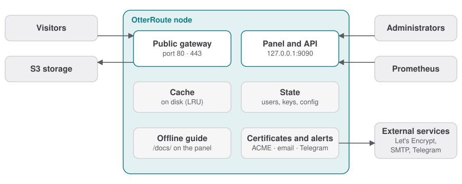

<p align="center">
  
</p>

<h1 align="center">OtterRoute</h1>

<p align="center">
  <strong>Publish your private S3 buckets on your own domains, with a disk cache. No proxy to configure.</strong><br>
  <sub>Self-hosted · read-only · a single binary · panel in English and Italian</sub>
</p>

<p align="center">
  <a href="https://github.com/garzuu/OtterRoute/actions/workflows/ci.yml"></a>
  <a href="https://github.com/garzuu/OtterRoute/releases/latest"></a>
  <a href="https://github.com/garzuu/OtterRoute/pkgs/container/otterroute"></a>
  
</p>

<p align="center">
  <a href="README.it.md">Italiano</a> · <b>English</b><br>
  <a href="https://garzuu.github.io/OtterRoute/en/"><b>📖 Documentation</b></a> ·
  <a href="#quick-start">Quick start</a> ·
  <a href="CHANGELOG.md">Changelog</a>
</p>

<p align="center">
  
</p>

---

## Why

You keep files in one or more S3 buckets (AWS, Cloudflare R2, Backblaze B2, Wasabi, Hetzner, MinIO, Garage…) and want to serve them from **`cdn.example.com`** without making the bucket public, without writing proxy rules, and without paying for every request to the storage.

Connect a storage, attach a domain, and get a URL that works. The node **really verifies** that the domain reaches it, keeps files in a disk cache, and tells you where a request stops when something is wrong.

<p align="center">
  
</p>

## What it does

| | |
|---|---|
| 🌐 **Many domains, many buckets** | Routing by host and path prefix; each bucket has its own credentials and an isolated cache. |
| 🔒 **Read-only** | `GET` and `HEAD` only, SigV4 signing. One request to the storage per object, then served from the cache. |
| ✅ **Domains verified for real** | DNS plus a real request to the node. If a domain stops reaching it, you see it and get notified. |
| 🔐 **Automatic HTTPS** | Free certificates (Let's Encrypt, HTTP-01) that renew themselves, or upload your own. The panel can also run over HTTPS, with an IP allow-list. |
| 🖼️ **On-the-fly images** | Resizing and conversion (WebP included) with `?w=800&fmt=auto`; variants stay in the cache. |
| 🔗 **Signed links** | Private files that open only with an expiring link, per route. |
| 🧭 **Diagnosis** | Type the address of a file that does not work: the node follows the request path (DNS, node, route, cache, storage) and tells you what to do. |
| 🧹 **Cache under control** | Purge a file or a whole route, warm up a list of files. |
| 👥 **Users and security** | Roles and permissions, 2FA with recovery codes, brute-force lockout, activity log. |
| 🔔 **Notifications** | Email (SMTP) and Telegram when a domain, bucket or certificate fails, when a new version is out or an update fails, and when everything is back to normal. |
| 📈 **Metrics** | Statistics in the panel and a Prometheus endpoint on `/metrics`. |
| 🔄 **Updates and backup** | Version check, self-update with Ed25519 signature and rollback; encrypted backup you can download from the panel, restore with version checks. |
| 🌍 **English and Italian** | Panel and documentation in two languages; the documentation is also available offline on the panel port. |

<p align="center">
  
  
</p>
<p align="center"><sub>Screenshots show the Italian interface; the panel switches to English from the user menu.</sub></p>

## Quick start

**Docker** (`amd64` and `arm64` images on GHCR):

```sh
docker run -d --name otterroute --restart unless-stopped \
  -p 80:80 -p 443:443 -p 127.0.0.1:9090:9090 \
  --sysctl net.ipv4.ip_unprivileged_port_start=0 \
  -v otterroute-data:/data \
  ghcr.io/garzuu/otterroute:0.1
```

**Binary** (Linux and macOS; verifies checksum and signature, and on Linux sets up a systemd service):

```sh
curl -fsSL https://github.com/garzuu/OtterRoute/releases/latest/download/install.sh | sudo sh
```

Then open **`http://127.0.0.1:9090/`**, create the administrator and follow the guided setup: domain → bucket → route. The panel stays **local only** (`127.0.0.1`): never publish port 9090 on all interfaces. The documentation is also available offline at `http://127.0.0.1:9090/docs/`.

> 💡 Behind Cloudflare or another proxy? See [HTTPS and proxy](https://garzuu.github.io/OtterRoute/en/guide/https-proxy). Docker Compose, Watchtower, systemd and launchd are covered in the [installation guide](https://garzuu.github.io/OtterRoute/en/guide/install).

## Documentation

How it works, installation, DNS and storage **provider by provider** (Cloudflare, Route 53, Google Cloud DNS, Azure DNS, OVHcloud, Aruba · AWS S3, R2, Backblaze B2, Wasabi, DigitalOcean Spaces, Hetzner, MinIO, Garage), HTTPS, users and 2FA, images, signed links, metrics, security and troubleshooting: **[garzuu.github.io/OtterRoute/en](https://garzuu.github.io/OtterRoute/en/)**. The sources are in [`docs/`](docs/).

## Development

```sh
cargo test --workspace               # includes the documentation checks
./scripts/local-e2e.sh               # two fake S3 servers with SigV4 and end-to-end tests
./scripts/panel-e2e.sh               # the panel against a real node (cache, HTTPS, updates, backup…)
./scripts/auth-smoke.sh              # users, scopes, 2FA and audit
cd web  && npm ci && npm run build   # panel (npm run check:i18n: translations)
cd docs && npm ci && npm run dev     # documentation (docs:build: IT/EN parity + links)
```

The tests in [`docs_check.rs`](crates/gateway/src/docs_check.rs) compare the documentation against the code: `config.yaml` examples, `OTR_*` variables, scopes and metrics. An English page must be updated together with its Italian counterpart. See [CONTRIBUTING](CONTRIBUTING.md) and [SECURITY](SECURITY.md) (in Italian).

## Status

Version **0.1.x**: a complete single node, ready to try.

| Stage | Status |
|---|---|
| Technical prototype: two domains, two private buckets, isolated cache | ✅ |
| Single node: panel, users, automatic HTTPS, diagnosis, notifications, backup, updates | ✅ |
| Signed links and on-the-fly images | ✅ |
| Cluster: Helm, synchronized configuration, per-replica apply status | 🔜 |
| Per-customer separate access | 🔜 |

---

## License

MIT or Apache-2.0, at your option.
